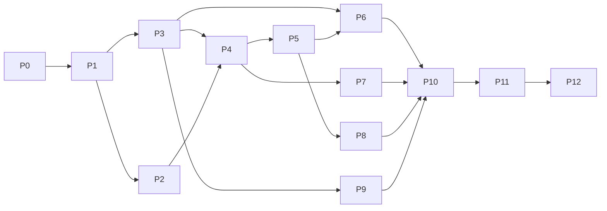

# REAPER 7.82 Linux 全量对齐实施计划

## 批准与交付约束

- 用户于 2026-10-09 批准总体计划，并确认主参照为 **Linux / REAPER 7.82 / 默认主题与配置**。
- 本文将批准的总体计划细化为开发任务；写入计划不代表任何功能已实现或通过参照验收。
- 仓库调研基线：`8cff888a44b67590f0969a3ece82d4ad9e9e0dba`。实施前检查主分支变化，保留本基线以便比较。
- 唯一开发分支：`feat/reaper-parity`。文档、代码、迁移、测试、修复和同步主分支均在此分支完成。
- 全部阶段只使用一个 PR；不开文档 PR、阶段 PR 或子功能 PR。PR 创建后记入[进度记录](../reaper-parity/progress.md)，后续持续更新同一个 PR。合并另按用户明确指令执行。
- 当前交付是实施计划文档。功能开发的实际状态由对齐矩阵与证据记录，不能从本文任务描述推断完成。

## 文档导航与优先级

| 文档 | 用途 |
| --- | --- |
| [参照基线](../reaper-parity/reference-baseline.md) | 固定版本、环境、默认配置、证据采集与平台边界 |
| [界面清单](../reaper-parity/interface-inventory.md) | 枚举全部界面类别及入口，指导 P0 展开 |
| [对齐矩阵](../reaper-parity/parity-matrix.csv) | 按条目追踪调研、实现与验收 |
| [交互规范](../reaper-parity/interaction-spec.md) | 定义输入、状态转换、焦点、拖动和动作一致性 |
| [领域与存储变更](../reaper-parity/domain-and-storage-changes.md) | 模型、引擎、存储、迁移和回滚边界 |
| [验证计划](../reaper-parity/verification-plan.md) | 视觉、行为、音频、性能、设备与跨平台证明 |
| [进度记录](../reaper-parity/progress.md) | 阶段状态、证据、阻断项和唯一 PR 信息 |

用户批准的目标优先于旧文档的 REAPER-inspired 范围限制。本计划定义此次范围和顺序，`DESIGN.md` 定义设计契约，架构文档与 ADR 保持实时安全、Action 和存储边界。旧文档中的快捷键、鼠标映射、通道上限和默认值均须在 P0 复核；冲突以固定版本实际观察为准，记录来源后修正文档。

## 目标与完成定义

覆盖固定参照的全部原厂界面、菜单、设置、动作入口和交互，以及使其真正工作的基础功能。视觉、操作、行为和功能分别验收；入口可点击但无实际结果不能计为完成。

AAADAW 品牌、工程扩展名和现有单文件工程能力保留。系统窗口装饰、原生文件选择器按同平台系统行为比较；第三方插件内部 GUI 按同插件比较，宿主包装界面仍在范围内。SWS、ReaPack 和用户安装扩展不属于原厂基线，单独登记，不从原厂清单中删除困难项。

Linux 为主参照；Windows/macOS 的构建和回归必须保持，平台专属能力按同版本同平台核验。Android 保持工程互通与触控能力，不能作为桌面界面的视觉验收依据。

覆盖率为“通过的原子验收条目 / 全部适用原子条目”。P0 尚未封闭清单时不发布总覆盖率；类别行不进入原子条目分母。缺证据、依赖未就绪或外部能力受阻的条目仍未完成。不得通过缩小清单、将缺失功能置灰或放宽误差宣称 100%。

## 代码基线与实施落点

| 当前证据 | 实施落点 |
| --- | --- |
| `crates/aaadaw/src/app/view/mod.rs` 将 Arrange/Mixer 作为互斥 workspace | 主布局、统一 Panel/Window Registry、Docker、窗口状态恢复 |
| `crates/aaadaw/src/app/commands.rs` 支持有限 Shortcut 变体 | 类型化输入组合、Action Section、统一动作和多绑定 |
| `crates/aaadaw/src/app/mod.rs` 的 MediaPanelDock 仅服务媒体面板 | 提取窗口与停靠生命周期，复用现有 Iced 窗口机制 |
| `crates/aaadaw/src/app/view/mixer.rs` 与 Arrangement 复用轨道控件 | 重做 MCP 几何、纵向推子与 Meter，保持控制与状态同源 |
| `crates/aaadaw-core/src/track.rs` 当前为单输出 Bus、Volume/Pan、CLAP Chain | 通用轨道、文件夹、Send/Receive、通道映射与扩展 FX 图 |
| `crates/aaadaw-core/src/audio.rs` 当前只保存 placement 和源偏移 | Take/Source、淡化、增益、Loop、Rate、Pitch、Stretch 数据 |
| `crates/aaadaw-engine/src/transport.rs` 当前维护位置与播放态 | 循环边界、速率、录音模式和一致时钟；UI Stop 策略单独核验 |
| `crates/aaadaw/src/app/view/render.rs` 当前提供 WAV 格式、Dither 和队列入口 | 完整 Render Settings、范围、编码、矩阵、命名与分析 |
| `crates/aaadaw-storage/src/store.rs` 当前 schema 为 17 | 顺序事务迁移；不得使用旧 ROADMAP 中的 v12 作为实际基线 |

保留现有波形缓存、媒体快照、CLAP helper、任务队列、录音恢复、Project Action 和 SQLite 生命周期。代码存在只说明可复用，不能代替 REAPER 对齐验收。

## 阶段依赖与开发方式

这是逻辑依赖，不表示必须等整阶段结束才能开发下一条垂直切片。例如 P9 的插件延迟信息为 P3 的全图 PDC 提供必要输入，二者按具体子任务互相接入。每个子任务均包含“模型 → 存储 → 控制层 → 引擎 → UI → 验证”中实际需要的层，不先堆出空壳 UI。只拆分本次功能需要的模块；新 crate、依赖或配置必须有具体生命周期和验收理由。

## P0 — 固定参照与全量差距登记

1. 获取并记录 Linux REAPER 7.82 安装包、SHA-256、运行环境；使用隔离配置目录启动，确认 Default 7、默认布局、快捷键与鼠标配置。保留初始配置指纹和关闭重开后的配置变化。
2. 建立一致测试素材：空工程、Audio/MIDI、多轨/文件夹、FX/Sidechain、Tempo、Take/Comp、Automation、Render、Video 和缺失素材工程。
3. 从主菜单、View、Options、Actions、各编辑器菜单及所有对象右键入口清点窗口。遍历 Preferences 类别树、Action Sections 和鼠标上下文；记录同一窗口的不同模式和状态。
4. 将[界面清单](../reaper-parity/interface-inventory.md)每一类别展开为可独立验收的矩阵行。记录截图/录屏、动作序列、前后状态、实际快捷键和来源；查明 7.81 手册与 7.82 差异。
5. 验证 Iced 的菜单、弹窗、Dock、焦点、输入与插件嵌入能力；优先复用自定义 widget 和平台适配，必要替代方案写 ADR。
6. 用重复采样确定视觉误差、音频误差和性能预算，冻结验收配置。调查主题、插件、时伸缩和编码依赖的使用条件，受阻能力留在矩阵中。

退出：全部入口有登记，清单可以追溯到实际运行证据；比较环境、误差标准及技术风险明确。仅检查源码或手册不能关闭 P0。

## P1 — 统一动作、输入和编辑事务

1. 将现有 CommandDefinition 扩展为稳定 Action ID、Section、标签、可用状态、Toggle 状态、菜单位置和调用目标；菜单、工具栏、搜索、宏、键鼠映射共用定义。
2. 支持 Ctrl/Alt/Shift/Super、字符/数字/标点、功能键、导航键、数字键盘和多绑定。平台键盘布局与字符/物理键语义按参照测定，不将所有输入压缩成 ASCII 字母。
3. 实现完整 Action List：搜索、Section、执行、绑定、冲突处理、自定义动作、导入导出与相关编辑窗口。保留已有配置迁移能力。
4. 建立鼠标上下文解析与可配置映射，处理 click/double-click/drag/wheel、修饰键变化、拖动阈值与取消。
5. 提取焦点/文本编辑/插件窗口的事件归属，区分局部和全局动作；批量编辑以 Project 事务原子提交，连续手势合并为正确历史单元。

退出：同一动作从不同入口产生相同结果；文本输入不触发全局编辑；冲突不会破坏旧绑定；跨对象手势撤销正确。

## P2 — 主窗口、视觉基础和停靠

1. 重建菜单栏、完整菜单层级、工具栏及其状态、Tooltip、右键菜单、配置窗口；根据参照建立控件、颜色、字体和几何 token。
2. 引入 Panel/Window Registry；主窗口同时容纳 TCP、Arrange、Transport 和 Mixer；取消桌面 Arrange/Mixer 互斥结构。
3. 提供四向 Docker、标签重排、Dock/Undock、浮动、拖动分隔、关闭重开、置顶和多显示器；跨窗口焦点遵循 P1。
4. 实现布局与 Screensets 恢复、失联显示器回退、DPI 变化和恢复默认布局。桌面窄窗保持桌面 profile，Android 仍使用触控 profile。
5. 将 TCP/MCP 改为参照的布局变体，纵向 Fader/Meter、Master 位置及各状态按证据实现。

退出：默认/窄窗/高 DPI/浮动布局截图与事件回放通过；resize 与窗口关闭不改动工程或传输状态。

## P3 — 通用轨道、混音与路由

1. 消除当前 Bus 专用目标限制，迁移旧 Bus 保持原有音频路径；实现文件夹层级、折叠、顺序与父子发送。
2. 实现 Audio/MIDI Send/Receive、Tap Point、独立 Gain/Pan/Mute/Phase、Master/Parent 开关、通道与 MIDI Bus/Channel 映射、硬件 I/O。
3. 以 P0 实测确定通道上限和默认值，扩展动态通道池；实现多输出乐器、Sidechain、插件引脚矩阵。
4. 实现路由图校验、图准备/切换、全图 PDC、反馈路径及其延迟语义；反馈能力按参照开关启用，单独测试。
5. 增加 Routing 窗口、Routing Matrix、Track Wiring、TCP/MCP Send 控件；Pan Law、Width/Dual Pan、Phase、Track Group/VCA 依参照实现。

退出：脉冲/阶跃/MIDI 路由测试证明 UI 设置对应实际处理；保存重开、撤销、删除依赖与图切换正确；回调无分配/锁/I/O。

## P4 — 时间线与基础 Item 编辑

1. 对齐轨道/Item 选择、框选、范围选择、焦点、定位、缩放锚点、滚动、Fit 和播放跟随。
2. 实现 Time Selection 与 Loop Selection 的独立状态及默认联动、标尺单位、Marker/Region 与管理窗口、Tempo/Meter 属性与时基设置。
3. 对齐 Snap/Grid、吸附偏移、临时覆盖、边缘/主体命中与交互优先级。
4. 扩展 Audio/MIDI Item 属性；实现边缘扩展/裁剪、Slip、复制、分割、Heal、Glue、Reverse、Loop Source、Gain、淡入淡出和交叉淡化曲线。
5. 精确输入与画布手势共用转换和验证；多选操作保留稳定 ID、相对位置和正确边界。

退出：相同事件序列产生相同 placement、源偏移和输出；撤销与保存往返通过，原始媒体不被隐式改写。

## P5 — Take、Comp 与高级编辑

1. 建立 Take/Source、Fixed Lane、Comp Area、Take Marker、评级、激活/播放规则；实现录音生成 Take 的接入点。
2. 实现 Take 切换、Explode/Implode、Propagate、跨轨 Comp 和编辑菜单/属性窗口。
3. 实现 Razor 区域、Ripple Off/One/All、Item 分组、锁定、包络随 Item 移动及跨轨批量操作。
4. 集成时伸缩/变调、Stretch Marker、保留音高和 Formant 选项；实现瞬态分析、动态分割与相关对话框。
5. 补齐谱峰/谱图、Spectral Edit/Repair、Sample 编辑等原厂入口及处理链，按 P0 确认的实际范围实现。

退出：Take/Comp 编辑可恢复；跨 Item/包络操作原子化；实时与离线使用相同处理参数；困难处理项不可由假控件代替。

## P6 — Transport、音频/MIDI 录音与设备

1. 对齐 Play/Pause/Stop、开始/结束定位、播放中定位、Repeat、Time Display、选择读数、Rate、Preserve Pitch、Tap Tempo、Scrub/Jog。
2. 在引擎按 sample block 拆分循环边界，处理 MIDI chase/reset、素材预读与自动化，不依赖 GUI Timer 实现循环。
3. 增加节拍器设置、路由、Count-in/Pre-roll、输入设备和通道选择、Off/Normal/Tape Auto 监听、录音前监听。
4. 实现音频/MIDI 录入、输入/输出录音、Punch、Loop、Overdub/Replace、实时量化、回溯 MIDI、录音后保留/丢弃与 Take/Lane 分配。
5. 接入 Input FX、设备时钟/延迟补偿、外部同步、掉线和磁盘失败恢复；调查并实现 Linux 对应原厂后端及设备设置。

退出：真机录音位置、监听与回放路径、循环和 Punch 边界正确；崩溃与掉线保留可恢复数据；未实测设备明确标记待验证。

## P7 — 全部 MIDI 编辑模式

1. 对齐 Piano Roll 的菜单/工具栏、键盘、音符颜色、选择、画笔、擦除、缩放、试听及局部快捷键。
2. 补齐 CC/Velocity/Pitch、Channel、Bank/Program、Aftertouch、SysEx 和文本事件；Lane 的增删、重排、缩放与曲线按参照实现。
3. 实现事件列表、事件过滤、属性、量化、Humanize、Transpose、Scale/Chord 相关操作、Drum Mode 和命名映射。
4. 实现 Inline、Pooled MIDI、多 Item 编辑、虚拟键盘、MIDI 文件导入导出、输入/输出与通道处理。
5. 实现 Notation 编辑器及其布局、符号、属性、编辑和导入导出入口，保持与 MIDI 数据一致。

退出：同一 MIDI 内容跨编辑器一致；事件顺序/通道/精度与播放可证明；保存重开和池化关联正确。

## P8 — 自动化、调制与分组

1. 扩展 Track/Take/FX 的 Envelope 身份、时间基准、点/曲线、可见性、激活/Arm/Bypass 和属性。
2. 实现 Trim/Read、Read、Touch、Latch、Write、Latch Preview 的手势、写入区间、回放、停止及提交规则。
3. 实现 Automation Item、Pool、Loop/Stretch、基线/幅度、跨轨复制和 Razor 编辑联动。
4. 实现 LFO、Audio Control、Parameter Link、MIDI/OSC Learn；控制值所有权与优先级可追溯。
5. 对齐 Envelope/Automation/Modulation 窗口、上下文菜单、Trim 控件及 Group/VCA 联动。

退出：各种模式在固定手势序列下写入预期数据；自动化与调制结果在实时/离线一致，撤销不丢失状态。

## P9 — 插件宿主与处理界面

1. 对齐 FX Browser、分类/搜索、扫描路径、FX Chain、浮动 Editor、Generic UI、Preset、参数和相关菜单。
2. 扩展 FX 可挂载位置：Track、Input、Take、Master、Monitor；实现 Wet/Dry、Delta、Oversampling、Pin Connector、Offline/Bypass 和复制排序。
3. 扩展 Linux 原厂基线所需的插件格式与 JSFX 运行/编辑能力；跨平台专属格式另列平台条目。旧格式的可实现性与条件必须记录，未解决则保持未完成。
4. 完整插件隔离、重启、状态恢复、缺失插件保留、GUI 关闭重开和主线程回调；效果插件与乐器分别验证。
5. 登记原厂自带效果器、空间声像、硬件 Insert 和网络处理窗口。明确自研等价处理、可合法复用与无法精确复现的算法，不将不同 DSP 宣称位级相同。

退出：宿主操作、参数手势和状态往返正确；第三方 GUI 不抢错焦点；插件异常不破坏工程；所有依赖差异透明。

## P10 — 媒体、工程与渲染交付

1. 实现 Media Explorer 的目录、数据库、搜索、元数据、波形、试听、Tempo/Rate、选区与拖入；保留嵌入、重链接和打包能力。
2. 实现 Project Settings 各页、模板、项目标签、Subproject、Project Bay、Track Manager、Marker/Region Manager、Undo History、Notes 和目录清理/Consolidate。
3. 实现 Render Source/Bounds、Sample Rate/Channels、Tail、文件名 Wildcard、Preset、格式、Dither/Noise Shaping、元数据、Normalize/Limit。
4. 实现 Region Render Matrix、Stem/Item/Region 批量导出、可保存 Render Queue、Online/Offline、Dry Run、LUFS/True Peak/统计报告与 Batch Converter。
5. 编码、重采样、冻结/渲染和视频输出使用后台任务与原子目标文件替换；取消和失败清理临时数据，不覆盖已有结果。

退出：范围/矩阵/队列可重复且文件内容正确；工程重开和素材管理不丢失引用；缺插件、空间不足和取消均有证明。

## P11 — 剩余原厂界面与配置

1. 对齐 Navigator、Big Clock、Performance Meter、各管理/分组窗口、Color Picker、Theme Adjuster/Tweaker、菜单与工具栏编辑、配置导入导出。
2. 展开并实现 Preferences 全部适用叶子页；General/Paths/Project/Audio/MIDI/Appearance/Editing/Media/Plugins/Control Surfaces/Mouse 等仅为调查类别，实际名称取自 7.82。
3. 接入 Video Window、视频媒体/处理器、ReaScript/JSFX 编辑运行与调试、API 所需行为和相关配置。既有 MCP 不自动成为 ReaScript 兼容层。
4. 实现 MIDI/OSC/控制台映射、外部时钟、Web Remote 和原厂网络相关界面及服务生命周期；涉及外设的条目使用设备验收。
5. 扫描 P0 清单、新增发现和阻断项，补齐所有剩余入口；扩展能力先有实际数据路径再开放界面。

退出：所有适用原厂条目均已实现并可验收；原厂/扩展/平台专属边界明确，未解决项阻止总验收通过。

## P12 — 全量验收与唯一 PR

1. 按矩阵回放所有原子场景，检查视觉、行为、音频、持久化和错误路径；从干净配置重跑默认工作流。
2. 执行 Rust 格式、Clippy、`cargo xtest`、平台和后端构建，以及 GUI、真机、多屏、高 DPI、迁移、安装和性能验收。
3. 比较基线与最终版本，记录误差、环境、命令、结果与证据；修复后只重跑相关证明和必要集成场景。
4. 更新首项目教程、平台/插件支持、快捷键与已知限制；完成率与产品声明一致。
5. 在唯一 PR 中汇总问题、最终行为、模块/迁移变化、证据、风险与检查清单；没有适用未完成项才标记 Ready。

## 风险、变更与停止条件

| 风险 | 处理与退出要求 |
| --- | --- |
| 缺少图形会话、设备或参照程序 | 继续独立的文档/模型工作，标记证据缺口；不能虚报界面或真机通过 |
| Iced/平台能力不足 | 最小探针验证，记录 ADR 后实现适配；不以 widget 限制降低交互目标 |
| 专有主题/算法、旧插件协议或编码依赖 | 记录具体资源、条件和可行替代；阻断项保持未完成，需用户明确接受范围变化 |
| 大范围数据模型迁移 | 单调 schema、事务、备份副本、旧工程 fixtures、未来版本拒绝及可恢复回滚 |
| 大工程性能与实时图切换 | 先测量，再优化；回调边界和任务内存上限保持不变 |
| 一个长期分支及一个大型 PR | 每切片可构建、独立提交、阶段检查点、持续同步与清晰审阅导航 |

P0 新发现属于同一基线的条目直接纳入清单。变更参照版本、减少验收范围、放宽标准或采用非等价替代，需要用户明确决定并记录；不重复请求已经批准的例行实现授权。工期在 P0 清单和技术探针完成后按工作量估算，不承诺无证据的日历日期。
