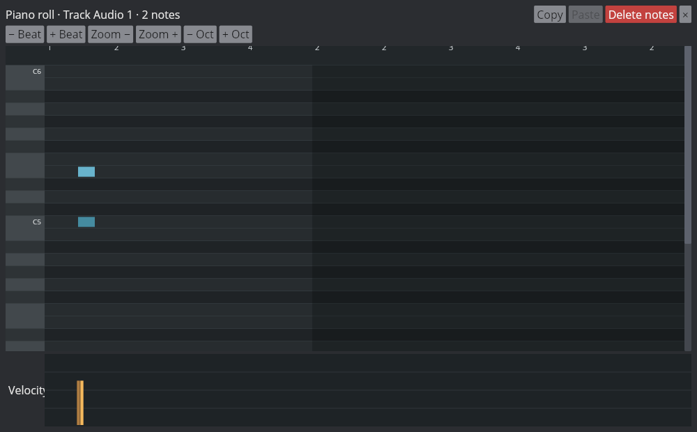
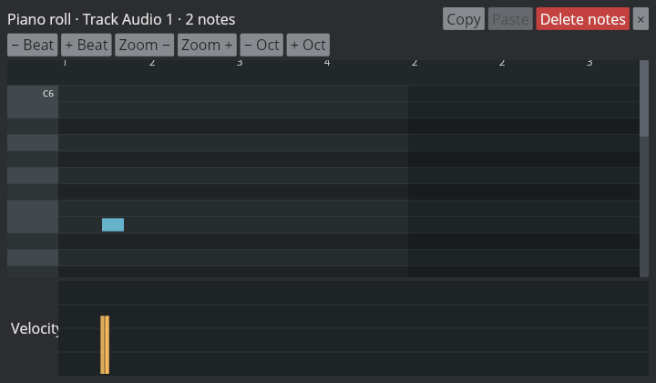

# MIDI editor layout review

Reviewed the native Iced MIDI editor under Xvfb on Linux at 1000×620 and 720×420. The screenshots use a temporary project with a two-note chord at one onset; no project or audio-device data was saved.

Verified interactions:

- The edit commands and navigation controls remain visible at both sizes.
- The pitch grid scrolls vertically while the Velocity lane stays pinned at the bottom.
- Ctrl+C and Ctrl+V copy the selected phrase; a second paste places another copy after the first. Undo and redo restore the prior and pasted note sets.
- Same-onset notes have separately hittable velocity handles. Hover changes the handle color; dragging a single handle and a multi-selection updates velocity with a live preview and one edit on release.
- MIDI note edits remain visible after resizing the editor.

Automated verification: `cargo xtest -p aaadaw` (214 passed), `cargo clippy -p aaadaw --all-targets -- -D warnings`, `cargo fmt --all -- --check`.
