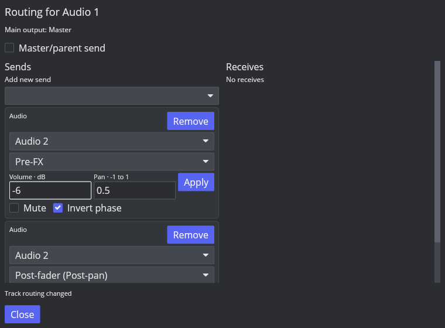

# AAADAW-ROUTING-003：发送位置

2026-10-09，Linux REAPER 7.82 / Default 7 / factory configuration；ROUTE-SEND-001 仍在进行。

## 实测参照

使用与前一探针相同的常量 Source 0.125，关闭 Source 主输出，静音 Receiver 自身 Item，Source 音量 0.5、声像全右。1 秒、48 kHz stereo PCM 渲染中间样本：

| REAPER I_SENDMODE | 位置 | Left | Right |
| --- | --- | --- | --- |
| 0 | Post-fader / Post-pan | 0 | 0.0625 |
| 1 | Pre-FX | 0.125 | 0.125 |
| 3 | Pre-fader / Post-FX | 0.125 | 0.125 |

源轨静音后，三种位置均为零。可复现脚本 [probe-send-taps.lua](../../../scripts/reaper_parity/probe-send-taps.lua) 仅用于隔离配置的临时空工程，需要 source.wav / receiver.wav 和 AAADAW_REAPER_PROBE_DIR，拒绝非空工程。

## 实现与验证

AudioSendTap 是每连接参数的一部分，Project/DawAction、Undo、Snapshot 和存储统一保留；UI 可分别选择，Receive 显示同一连接的位置。schema 20 给旧 Send 增加 tap=0，保留已有音频结果和 ID。

回调复用 Pre-FX、Post-FX、Post-fader 三个预分配缓冲；源轨 fader/ramp/meter 仍只推进一次。前级发送绕过源 fader/pan，保留独立 send volume/pan/phase 和 track mute/路径 Solo 门控。合成 CLAP FX 增益 0.5、源 fader 0.25 / pan 全右时，Pre-FX 为左右 0.125，Pre-fader 为左右 0.0625，Post-fader 为左 0 / 右 0.015625；这验证了 FX 与 fader 的边界，不代表第三方插件验收。

完整 cargo xtest：759 passed / 0 skipped；Clippy -D warnings、默认构建通过。旧 schema 19 Send 默认位置恢复、非默认位置往返、Core Undo/Snapshot、实际渲染及前级发送回调零分配均通过回归。GUI 已从恢复的工程独立切换第一条 Send 为 Pre-FX，第二条保留 Post-fader。

多通道/MIDI/硬件、文件夹、反馈/PDC、路由矩阵和完整 REAPER 窗口交互仍待开发；前一切片的原生文件选择器与 MIDI 动态计划限制继续适用。P3 未关闭。
