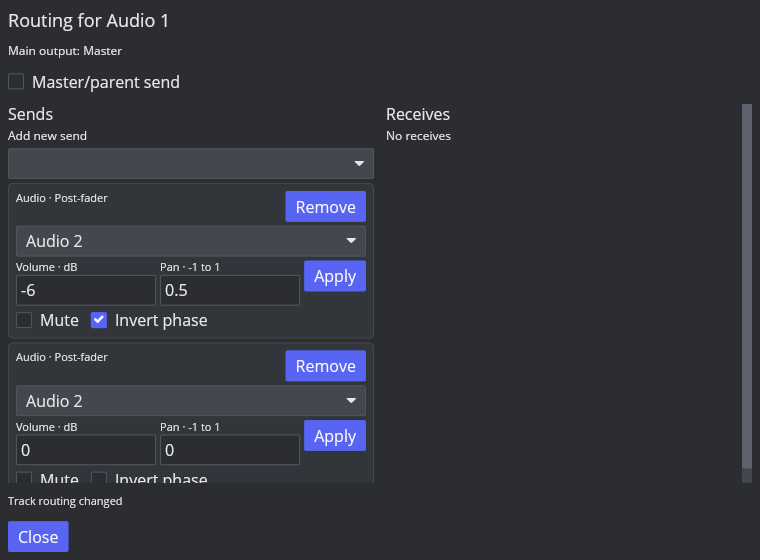
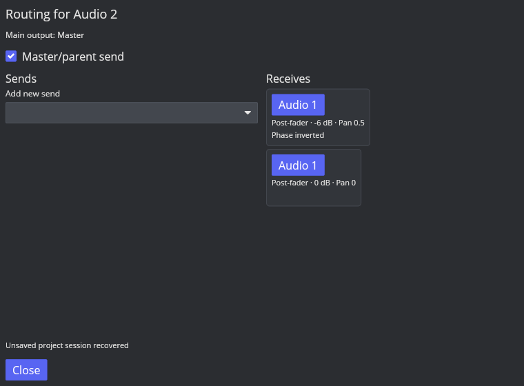
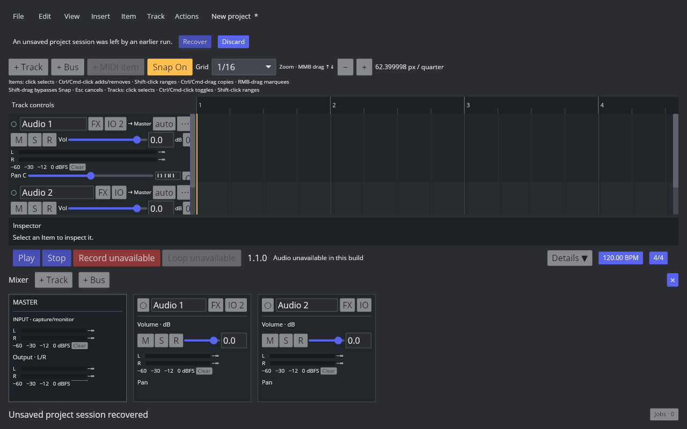

# AAADAW-ROUTING-002：并行音频 Send 基础

2026-10-09；Linux REAPER 7.82 / Default 7 / factory configuration；ROUTE-SEND-001 仍为 in_progress。

## 参照与实现

实际 REAPER 离线探针：Source 为常量 0.125，Receiver 为常量 0.25，Other 无媒体；Source 主输出开启并分别发送到 Receiver、Other。48 kHz、1 秒、stereo PCM，中间样本：Solo Receiver 左右各 0.375，只开放通往 Receiver 的上游路径；Solo Source 左右各 0.375，开放三条输出路径并抑制接收轨道自身媒体。单输出探针见 [前一切片](ordinary-track-routing.md)。未覆盖硬件录音与第三方插件。

实现稳定 SendId 的多条独立 Post-fader 音频发送，包括相同目标、音量、线性声像、静音、反相、主输出独立开关和重定向。Receive 是同一连接的反向视图。Project/DawAction 维护引用、参数和整个 DAG；禁用连接也参与环路检查，禁止删除仍被引用的目标。撤销、批量失败与 Snapshot 分配器恢复均有回归。

引擎按主输出与所有 Send 拓扑排序。每轨 FX 后的 fader/pan、automation、ramp、meter 只计算一次，再扇出到各路径；回调使用预分配 scratch。Solo 区分上游来源与下游接收，避免无关 Master/Other 路径漏音。冻结单轨时清除隔离快照的外部 Send，并恢复该快照主输出，不改原工程路由。

schema 19 增加 tracks.main_send_enabled（旧工程默认开启）及有 ID/顺序/FK 的 track_sends。schema 18 迁移保留原 output_track_id 与 PanMode；保存往返保持连接顺序、参数与身份。

## 验证

- 完整 `cargo xtest --no-fail-fast`：756 passed / 0 skipped；默认 Clippy `-D warnings`、默认构建、格式检查通过。
- JACK/PipeWire combined all-targets check 通过，仍有此前已有的两条 feature warnings。
- 回归覆盖重复目标、主输出独立开关、参数/环路/删除/ID 原子性、schema 18→19、反相/静音/声像、逆显示顺序、并行路径 Solo、mono/stereo、fader ramp/meter 单次推进及回调零分配。
- 合成 isolated instrument 与 MIDI schedule 回归证明接收 Solo 不丢失上游事件；事件仍归属原轨道，不实现 MIDI 复制发送。
- GUI：添加两条到 Audio 2 的发送，第一条设 -6 dB / Pan 0.5 / 反相，关闭主输出。进程重启后通过 unsaved-session recovery 恢复，ID、参数、主输出开关及两条 Receive 保持。TCP/MCP 头部 IO 入口可用，避免默认 Mixer 高度裁掉底部入口。

虚拟桌面无原生文件选择器服务，Save 的 PathPicked 实测为 Ok(None)，GUI 普通另存为/重开尚未证实；SQLite 保存/重复保存/重载由自动测试验证。一次旧运行实例菜单未展开，新构建未复现，未将其记为已定位修复。

## 剩余差异

Pre-FX/Pre-fader、MIDI Send、通道映射/多通道、硬件输出、文件夹 Parent Send、反馈/PDC、Routing Matrix/Wiring、完整路由窗口布局与操作仍待实现。现有 MIDI 计划在编译时过滤 mute/solo，播放中解除 Solo/静音后的事件计划动态恢复仍待补齐。P3 与全量对齐未完成。
