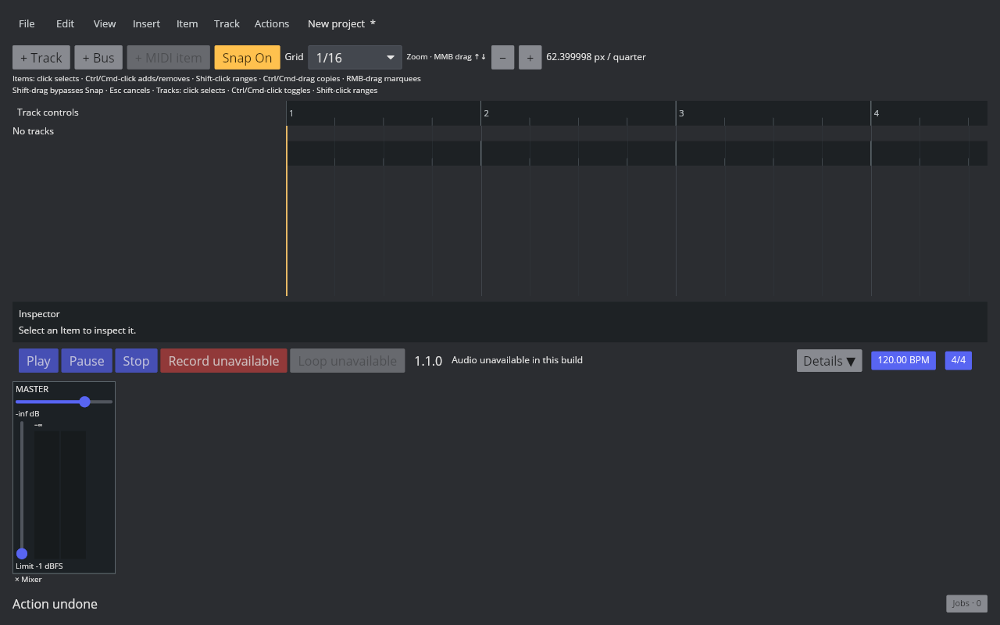
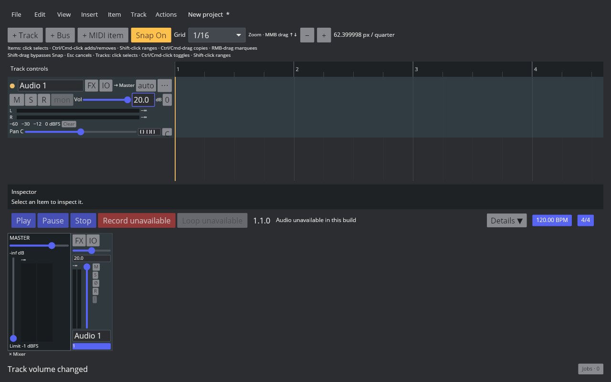

# Default 音量推子映射

2026-10-10，Linux REAPER 7.82 / Default 7 / 独立默认配置，MIX-FADER-001 仍在进行。

Preferences → Appearance → Track Control Panels：Volume fader range 下限显示 −72（Default 形状时禁用），上限 +12 dB，shape=Default。此数值不是 Default 曲线的零增益端点：公共 API SLIDER2DB(0) 返回 −1000，DB2SLIDER(−1000) 返回 0。

[probe-fader-curve.lua](../../../scripts/reaper_parity/probe-fader-curve.lua) 只读取公共 API，导出 position 0..1000、步长 0.1 的 10,001 个 SLIDER2DB 样本，以及 dB −1000..12、步长 0.1 的 10,121 个 DB2SLIDER 样本。原始 CSV SHA-256：

```text
fader-curve-reference.csv 09b1b6c9354debd2cbe27109b3e5b697665f42a3f53c9452ec49336c9212d341
fader-forward-reference.csv 3a1d0d6543dd61826562f080f7cc622c98fad1dffbdb74ec4f23b2ceafa5ed22
```

| dB | DB2SLIDER |
| --- | --- |
| −72 | 50.156251 |
| −60 | 79.482343 |
| −24 | 313.298690 |
| −6 | 592.848336 |
| 0 | 716 |
| +6 | 852.286980 |
| +12 | 1000 |

两函数在极低值区不是严格互逆：SLIDER2DB(3.1)=−1000，而 3.2=−143.711601；DB2SLIDER(−150)=2.513873。因此分别保留两组实测表，不通过倒转一张表猜另一函数。

[generate-fader-data.py](../../../scripts/reaper_parity/generate-fader-data.py) 验证数量、有限值和单调性并生成静态事实数据；前向表压缩第一非零样本之前的零值区，第一非零坐标是 −331.0 dB。生成结果可逐字复现。数据来自数值测量，不含 REAPER 资源或实现代码。

TCP、MCP、Master 的控件采用 position 0..1000；普通步进 1，Shift 步进 0.1，对应表中的独立 API 样本。显示任意领域 gain 时，对 DB2SLIDER 的 0.1 dB 网格线性插值。零端点以有限 −1000 dB 保存，实际 f32 系数严格为 0；显示 -inf，TCP 精确输入接受 -inf / -∞。推子上限 +12；继续沿用预览、单次提交、撤销和重置。

补测 TCP Volume knob 右键打开 Routing，volume 录入 20、Tab、关闭窗口；TCP tooltip 仍显示 +20.0 dB，MCP 推子位于顶部。因此精确数值入口保留范围外值，控件几何才限制至 +12；非有限值/溢出系数拒绝，不截断合法值。

不把采样插值视为任意实数输入的数学精确等价：网格外误差、原厂鼠标灵敏度/修饰键、键盘/滚轮、全部自定义范围与形状、完整精确数值对话框和主题仍待验证。P2 未关闭。

首轮 33 项 focused 通过；最终表完成后 audio-device 全量 813 项测试通过，默认 Clippy warnings denied 通过，生成脚本逐字复现数据通过。回归含独立参照点、单调性、有限零增益、+12 数值入口、Undo/Snapshot 和实际输出/Meter 为零。

音频功能构建通过（保留已有两项警告）。GUI 实际双击恢复 0 dB，拖至底端显示 -inf、SQLite 保存 −1000；拖至顶端显示 +12，Ctrl+Z 恢复 -inf，随后 SQLite 也恢复 −1000。该环境没有真实设备输出，音频零值以引擎回归证明。




最后精确入口修正后 18 项相关测试、Clippy 和音频构建再次通过。GUI TCP 输入 20 并按 Enter 后，TCP/MCP 均显示 20.0，MCP 几何停在顶部；未截断领域值。


