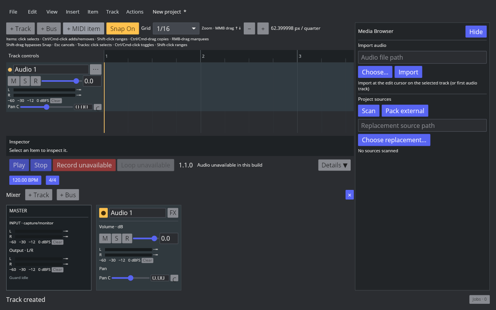

# AAADAW-DESKTOP-001

基准：Linux REAPER 7.82，Default 7，默认配置；实机观察到默认 Mixer 可见、Master 左置，Transport 位于 Arrange 与 Mixer 之间。

实现：显式 Desktop/Touch profile，桌面 Arrange 始终显示；Mixer 与 Media Browser 独立开关与分割比例。Ctrl+M 切换 Mixer；布局版本 1 原子写入 desktop-layout.json，500ms 防抖，空闲订阅保持运行，关闭时刷新。无效文件保留并报告错误。

验证：732 项 workspace 测试全部通过，Clippy warnings denied 通过。GUI 新建轨道后 TCP/MCP 同步；三个面板同时可见，View 菜单正常；空闲配置包含两个开关及比例。Transport 响应式容器已改为收缩高度。

仍未完成：Default 7 视觉尺寸与主题、Docker 四边位置/标签/浮动窗口、多屏/DPI 恢复、完整窗体集合、REAPER 全量输入与布局验收。本记录不证明 P2 全量通过。
