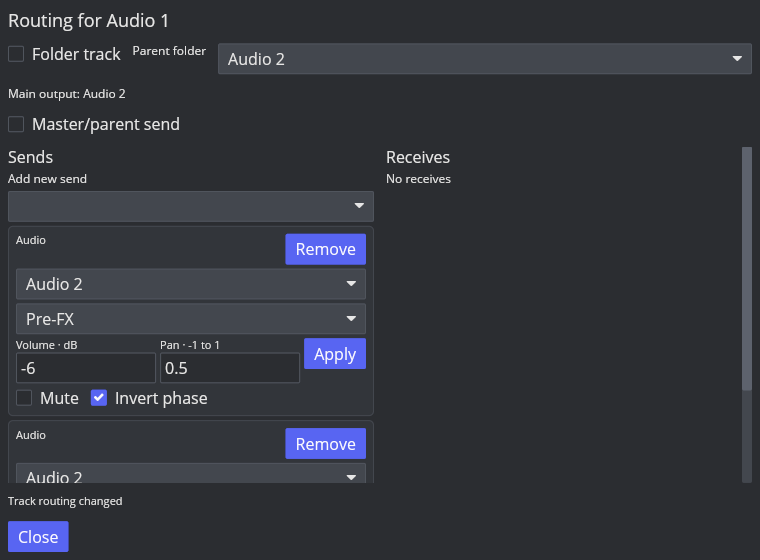
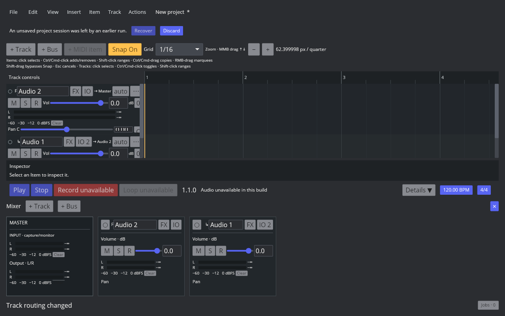

# AAADAW-ROUTING-004：嵌套文件夹与 Parent Send 基础

2026-10-09；Linux REAPER 7.82 / Default 7 / 默认配置；ROUTE-FOLDER-001 仍在进行。

## 实机参照

Outer 自身常量 0.25，Inner 无媒体，Leaf 0.125，Sibling 0.125，Outside 无媒体；Inner 属于 Outer，Leaf 属于 Inner，Sibling 属于 Outer。默认 Parent Send 开启，Folder Compact 为 0。

| 场景 | 左右中间样本 |
| --- | --- |
| 默认嵌套汇总 | 0.5 |
| Inner Parent Send 关闭 | 0.375 |
| Solo Inner | 0.125 |
| Solo Leaf | 0.125 |
| Solo Outer | 0.5 |

复现脚本 [probe-folders.lua](../../../scripts/reaper_parity/probe-folders.lua) 使用隔离配置及临时空工程，输入和环境变量同其他路由探针，不保存用户工程。

另外实测 Outer I_FOLDERCOMPACT=0/1/2：默认配置中 Outer、Outside 始终 74 px；其全部后代分别为 74/25/4 px。此尺寸证据用于下一步压缩显示，不表示 AAADAW 已匹配该布局。

## 实现及验证

is_folder 与稳定 parent_track_id 表示森林；Project 验证父节点为文件夹、父先子后、子树连续，拒绝层级/路由环路。重新指定父文件夹或移动轨道时带完整子树移动；Undo 仅恢复顺序/父关系/角色元数据，保留对应媒体、FX 和 TrackId。有效主输出默认走父节点，显式旧 output_track 优先，主输出开关仍独立。Receive 保留 Send 的单份反向视图。

schema 21 对旧轨道默认 is_folder=false / parent=NULL，不把历史 Bus 转成文件夹。保存重载保留嵌套关系和媒体所有权。引擎与 MIDI 计划均使用有效 Parent 路径，回调分配回归包括文件夹与前级发送。

767 项 workspace 测试通过，Clippy -D warnings 与默认构建通过；覆盖实际汇总、Parent 开关、嵌套 Solo/静音、身份/顺序/Undo/Snapshot、无效父节点/删除/环路、旧 schema 20 Bus 迁移、SQLite 往返、MIDI 上游来源及回调零分配。

GUI 已把 Audio 2 标为 Folder，Audio 1 设为其子轨；TCP/MCP 同步重排、层级标识和主输出目标更新。路由窗口可建层级，Track menu/Action List 注册 track.toggle-folder。

## 尚未完成

压缩/展开显示、默认 Folder 按钮循环、文件夹拖动/深度调整手势、MCP 文件夹显示策略与完整默认主题均待下一步。当前冻结仍只支持原有独立 instrument 角色，Folder Freeze 未开发；拒绝冻结文件夹或把已冻结轨道改为文件夹，避免烘焙/接收路径错误。GUI 原生保存与 MIDI 动态计划限制仍见前一切片。P3 和产品全量对齐未关闭。
