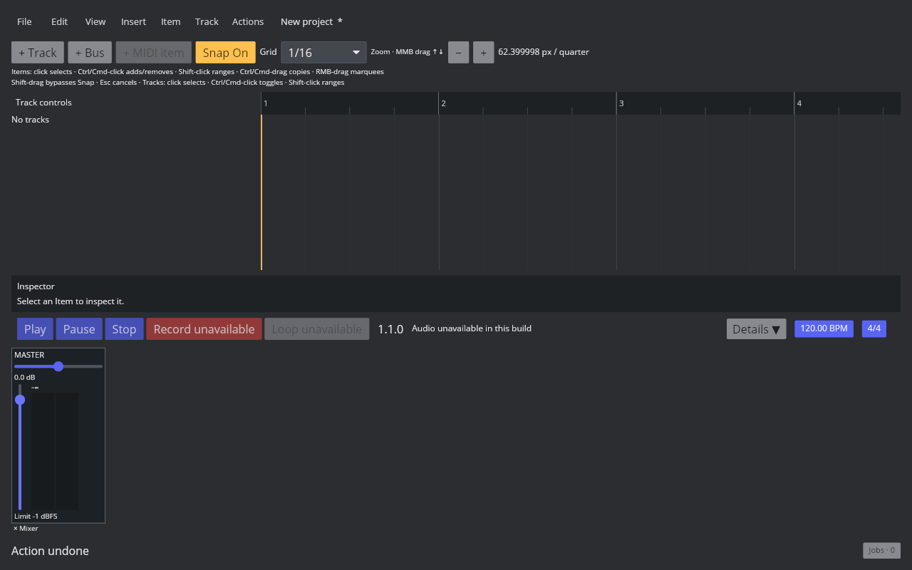
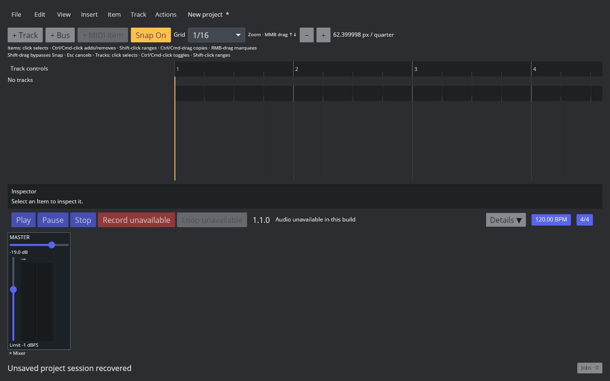

# Master 音量与 Stereo Balance

2026-10-10，Linux REAPER 7.82 / Default 7 / 独立默认配置。参照使用 [probe-master-mix.lua](../../../scripts/reaper_parity/probe-master-mix.lua)，空工程的一条轨道播放 0.125 常量 mono，48 kHz、Stereo PCM24、1 秒，第 24000 帧。

| Master 控制 | 左通道 | 右通道 |
| --- | --- | --- |
| Unity / center | 0.125 | 0.125 |
| D_VOL=0.5 | 0.0625 | 0.0625 |
| D_PAN=-0.5 | 0.125 | 0.0625 |
| D_PAN=0.5 | 0.0625 | 0.125 |

工厂回读 D_VOL=1、D_PAN=0、D_PANLAW=-1、I_PANMODE=3、B_MUTE=0、B_PHASE=0。SetMediaTrackInfo_Value 对 B_MUTE/B_PHASE 返回 true，设置值也能回读；但上述离线 Master render 的 muted/phase 两例仍输出 0.125/0.125。这仅记录当前导出路径的观察，不能推断实时监听、硬件输出或其他 Render Source 的语义；后续须独立验证。

实现使用独立 MasterMix，不占用普通轨道 ID 0；SetMasterMix / Undo / Snapshot，schema 24 的 project_master_mix 保存 gain/balance，旧工程默认为 unity/center。音频图在轨道路由求和之后、输出 guard 和 Meter 之前处理 Master；单次 AtomicU64 发布两个系数，5 ms ramp 持续跨块。Freeze 的隔离源快照清除 Master 控制，避免烘焙后重复衰减。实时播放包装器和 UI 历史同步使用同一控制器。

桌面 Master 加入真实纵向音量推子与声像控件；预览不改工程历史，释放后单次提交，支持撤销、右键/Escape 取消、双击重置、Shift 精调，待提交期间 Undo 入口可用。完整推子曲线/范围和精确数值录入尚待对齐，触控 Master 控件仍需展开。

audio-device 全量 809 项测试通过；默认 Clippy warnings denied 通过。默认全量 786 项中的 785 项通过，CLAP 编辑器连接 X11 失败；专用无 WM 显示加 -noreset 后，最后修改及失败项的 68 项 focused 全部通过，随后完整 audio-device 测试也通过。更早一次 RT 分配测试的输入降低了原有削波峰值，调整输入后恢复该断言；实际分配计数保持为 0。

Master Mute/Solo/Phase、FX、Automation、完整 Meter 及界面尚未验收，P2/P3 仍在进行。

音频功能构建通过，保留已有两项编译警告。GUI 推子拖动提交为 −19.0 dB，Ctrl+Z 恢复 0 dB，Redo 后调整 pan；SQLite 回读 −19.0 / 0.4799999595。终止后重启、Recover 恢复两个控件。本环境该构建没有可用 Linux 音频后端，实际硬件播放/监听未验证；普通原生 Save/Reopen 的完整 GUI 流程也未关闭。

