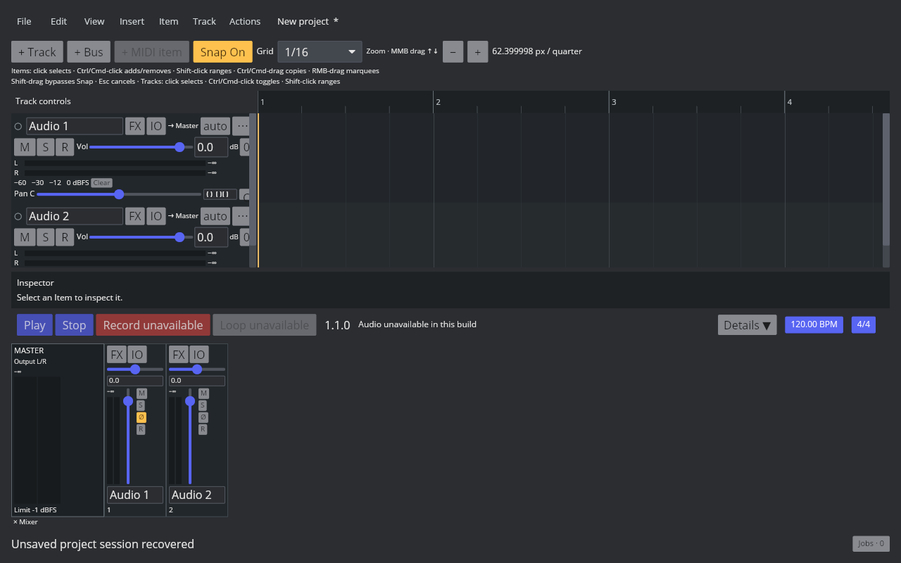
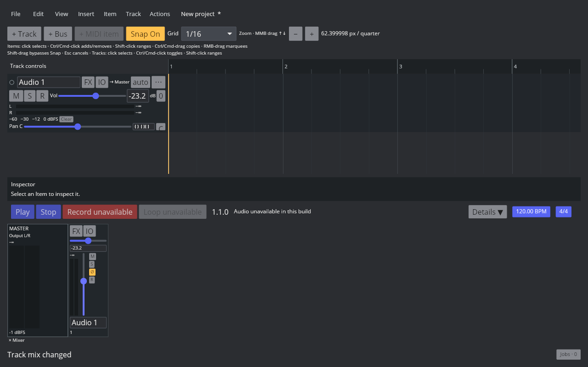
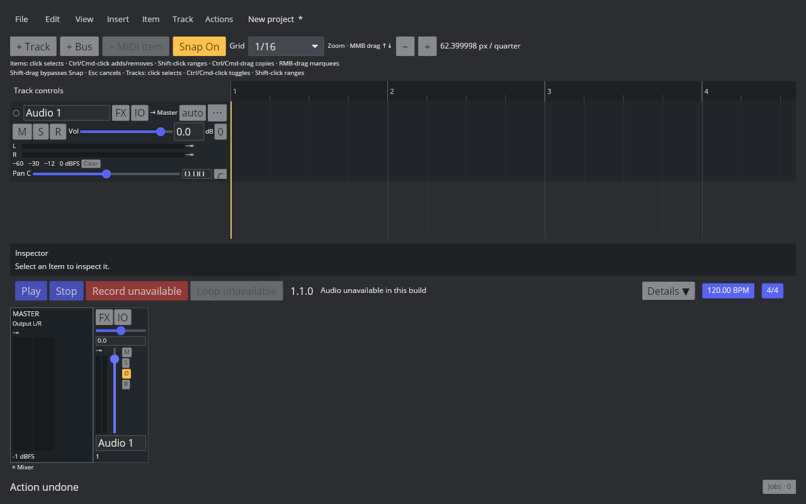
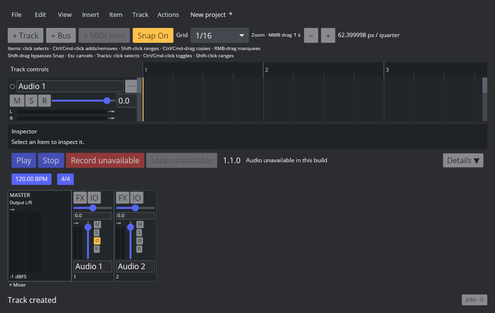

# 桌面 MCP 纵向布局

2026-10-09，MIX-FADER-001 / P2，仍在进行。

[probe-layout.lua](../../../scripts/reaper_parity/probe-layout.lua) 在 Linux REAPER 7.82、Default 7、独立默认配置的空工程插入两条轨道，等待布局完成后读取 API。主窗口 client 1024×768：Master I_MCPW=132，普通轨道 I_MCPW=88，两条 I_MCPX=0/88；MCP 高 240。TCP 普通高度 74，I_TCPW 返回 0，不能据此推断实际宽度。参照截图仅留临时目录，不提交产品资源。

桌面 MCP 使用 132/88 px 条宽、纵向推子、双通道纵向峰值表头、顶部 FX/IO、M/S/Phase/R 和底部名称/序号；底部 Mixer 入口可以关闭。触控 profile 保留原控件。拖动沿用预览/释放提交/取消/双击重置和 Shift 精调的现有手势，领域状态仍通过 DawAction 改变。

GUI 实际拖动 Audio 1 到 −23.2 dB，TCP 同步，SQLite 恢复记录为 −23.1999988556；Ctrl+Z 后两个入口恢复 0 dB。1024×650 的两轨窗口仍呈现纵向条和操作入口。恢复后反相按钮保持开启。

779 项 workspace 测试、默认 Clippy warnings denied、默认构建通过；audio-device check 通过，保留已有两项编译警告。最后监控按钮守卫和 Master Limit 标签调整后再次通过 Clippy、构建、音频功能检查。

Master 目前只有实际输出 Meter 和限制器读数；Limit 标签不代表音量。真实 Master 推子/混音状态尚未实现。主题颜色、字体、推子曲线与范围、Pan 旋钮、全部高度变体、每通道峰值保持/刻度/RMS、默认 TCP 布局、完整 Docker 和 DPI 均待完成，不把条宽测量与功能回归视为完整像素验收。

后续 2026-10-10 [Master 基础切片](master-mix.md) 已加入真实 gain/balance 与控件；其余差异继续保持未完成。
