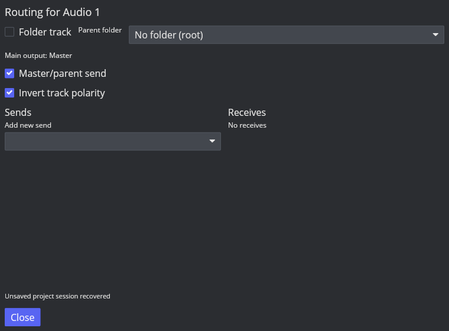

# 轨道反相与发送位置

2026-10-09，Linux REAPER 7.82 / Default 7 / 隔离默认配置，ROUTE-PHASE-001 仍在进行。

## 实机音频参照

[probe-track-phase.lua](../../../scripts/reaper_parity/probe-track-phase.lua) 使用独立临时空工程；输入同 Send 探针，Source 常量 0.125、fader 0.5、pan 0，主输出关闭，Receiver 自身 Item 静音。48 kHz、Stereo PCM24、1 秒，读取第 24000 帧；不提交 REAPER 二进制或资源。

| Source B_PHASE | Post-fader 0 | Pre-FX 1 | Pre-fader 3 |
| --- | --- | --- | --- |
| 0 | 0.0625 | 0.125 | 0.125 |
| 1 | -0.0625 | 0.125 | 0.125 |

两通道相同。这证明轨道反相位于前级发送捕获之后；不能把所有 Send 的源缓冲区一起反转。

## 实现与验证

Track phase_inverted 与 SetTrackPhase/事件、Snapshot、Undo/Redo 已接入；schema 23 旧轨道默认 false，非默认值保存往返。引擎对最终 fader 输出乘极性，主输出和 Post-fader Send 使用反转结果，Pre-FX/Pre-fader 保持原捕获。实时 AtomicBool 更新不重建图，Meter 仍为绝对峰值。Track menu/Action List 注册 track.toggle-phase，Routing 的独立复选框使用相同领域动作；Undo 同步实时参数。冻结隔离快照清除 phase，原轨保留，避免重复烘焙后级极性；实际完整 Folder/Freeze 行为仍未验收。

默认 779 项 workspace 测试、audio-device 802 项测试全部通过；默认 Clippy warnings denied 与构建通过。回归包含三个 Tap 的正反相及两次实时切换、主输出和 mono Mixer、非负 Meter、Undo/Snapshot/失败批次原子性、旧 schema 22 迁移和 SQLite 往返、注册动作状态。音频功能构建仍有既有两项编译警告，详见传输入口记录。

GUI 打开 IO、启用 Invert track polarity，重启后 Recover 并重开 IO，复选框仍开启。此处验证会话恢复，普通原生 Save/Reopen 限制未关闭。

TCP/MCP 默认反相按钮布局、完整主题、动态切换的点击抑制/偏好、更多通道及硬件行为仍待对齐，P3 未关闭。
