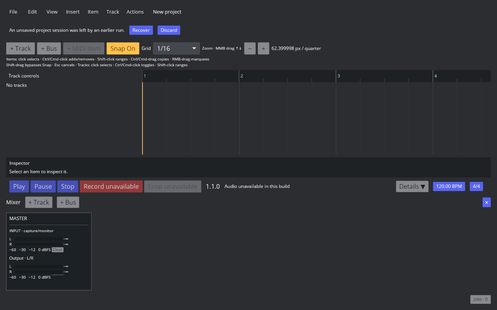
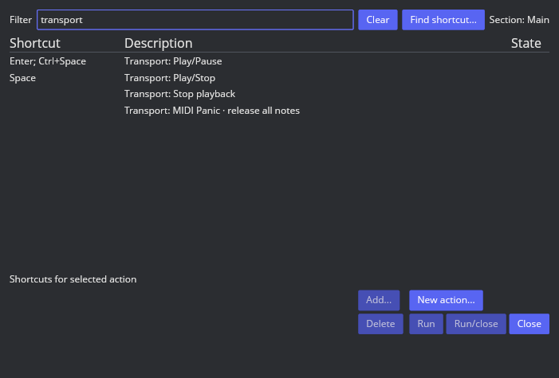

# 默认传输动作入口

2026-10-09，TRANSPORT-PLAY-001 / P1、P6 基础续项，仍在进行。

固定版本动作目录 Main 40044 Play/stop = Space；40073 Play/pause = Enter / Ctrl+Space；1007 Play、1008 Pause、1016 Stop 无显式绑定。AAADAW 新增 transport.play-stop，将 Space 分发到停止或开始；transport.toggle-playback 保留原稳定 ID 和暂停/恢复语义，工厂绑定改为 Enter / Ctrl+Space；Stop 删除旧工厂 Shift+Space，用户显式设置仍保留。新增工厂组合让位于用户显式配置，显示与分发一致。桌面 Play、Pause、Stop 为独立按钮，触控继续现有紧凑布局。

Play/Stop 复用现有 stop-to-start/start 路径；录音及准备期间进入 stop_recording。停止类 command 在录音/播放准备守卫下可达，Stop 同时可取消等待中的输入准备；其他工程动作仍受守卫保护。

797 项启用 aaadaw/audio-device 的 workspace 测试全部通过，涵盖三个工厂组合、未绑定 Shift+Space、旧显式 Play/Pause=Space 与 Stop=Shift+Space、MIDI 窗口旧停止组合，以及录音准备时从两个注册动作取消。默认 Clippy warnings denied 通过；audio-device 构建成功，保留其既有 unused_mut / SharedRecordingInputRecovery 警告。GUI 验证三个独立按钮及 Action List 的工厂组合一致。

环境未连接真实音频设备，GUI 按钮显示不可用；不能据此声称已验证播放/暂停/停止的设备输出、全部编辑游标/暂停位置偏好或停止录音后的媒体对话框。单独 Play/Pause 注册动作、Repeat、Rate、Scrub/Jog、其他传输窗口及全量状态轨迹仍待开发/实测。
